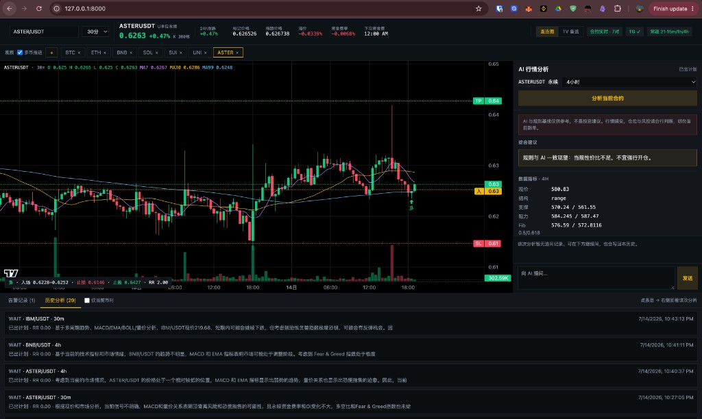
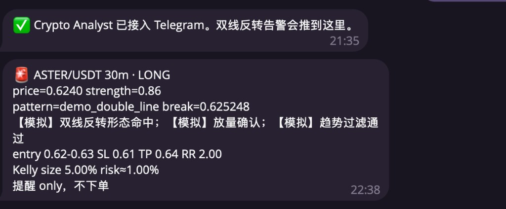

# Crypto Analyst

AI 行情分析、预测与结果验证 + U 本位永续实时盯盘（规则告警 / Telegram）。

拉取多周期数据 → **AI 给出观点与计划** → 到期后对照真实 K 线做验证；Web 常驻规则引擎盯盘，命中后推送到 Telegram（只提醒、不下单）。

<p align="center">
  
</p>

<p align="center"><em>Web：K 线 / 多空计划叠加 + AI 分析侧栏 + 历史会话</em></p>

<p align="center">
  
</p>

<p align="center"><em>Telegram：双线反转等规则告警（含入场区间 / SL / TP / Kelly）</em></p>

---

## 它做什么

- 结构化输出 **技术面 + 周期语境** 下的观点与交易计划（入场、止损、止盈、RR）
- **同一套提示词与数据快照** 落库，方便对照「当时怎么说、后来怎么走」
- 到期后自动/手动 **验证**，把预测与真实 K 线对齐
- Web 常驻盯盘：双线反转等规则命中 → **Telegram 推送**（不下单）

主路径：

```
Web 盯盘（常驻推 TG） ↔ 选币分析落库 →（可选）到期验证 → 历史会话复盘
```

---

## 环境要求

- **Python 3.11+**（推荐 3.11 / 3.12）
- 能访问 **Binance** 行情；LLM 需自备 API Key

---

## 安装

在本仓库根目录执行（任选其一）：

```bash
# uv（推荐，已含 uv.lock）
uv sync --extra web

# 或 venv + pip
python3 -m venv .venv
source .venv/bin/activate
pip install -e ".[web]"          # Web；开发再加 .[dev]
```

安装后可用命令 **`analyst`**。

---

## 配置

```bash
cp .env.example .env
# 至少配置一种 LLM；盯盘推送再配 TELEGRAM_* 与 MONITOR_ALWAYS_ON=true
```

- DeepSeek（默认示例）：`DEEPSEEK_API_KEY`、`LLM_PROVIDER=deepseek` 等，详见 `.env.example`
- 连通性：`analyst config test-llm`
- 首次：`analyst db init`

支持的 LLM（`.env` 切换）：DeepSeek、b.ai、Anthropic、Groq、OpenRouter、Ollama、OpenAI。

---

## 运行

请在**项目根目录**启动（与 `analyst.db`、`.env` 同级）。

### Web（推荐）

```bash
./scripts/run-web.sh
# 或：analyst web
```

默认 **http://127.0.0.1:8000**。

- 首页：U 本位图表 + AI 分析/对话 + 规则告警历史
- 关网页仍要推 TG：设 `MONITOR_ALWAYS_ON=true`，并保持 web 进程在跑
- 多级别：`MONITOR_DAEMON_TIMEFRAMES=15m,1h,4h`
- 品种：`MONITOR_DAEMON_SYMBOLS=...` 或页面观察列表

### CLI

```bash
analyst monitor once BTC -t 15m
analyst monitor start BTC -t 15m
analyst practice BTC
analyst verify
analyst history
```

| 命令 | 作用 |
|------|------|
| `analyst web` | Web + 常驻盯盘 |
| `analyst practice <symbol>` | 创建会话并跑 AI |
| `analyst verify` | 验证已到期会话 |
| `analyst progress` / `weakness` / `ai-benchmark` | 统计 |
| `analyst history` / `review <id>` | 历史与复盘 |
| `analyst config test-llm` | LLM 连通 |
| `analyst db init` | 初始化 SQLite |

---

## 本地持久化

| 数据 | 落盘 | 说明 |
|------|------|------|
| AI 会话、计划、验证、聊天 | 是 | `analyst.db`（SQLite） |
| 常驻盯盘品种列表 | 是 | `.cache/data/monitor_daemon.json` |
| REST K 线 / 衍生品短缓存 | 可选 | `.cache/data/`（TTL 几分钟） |
| 实时 WS K 线 | 否 | 内存滚动；历史可 REST 回补 |
| 规则告警历史 | 目前内存 | Hub 约 200 条 |
| 浏览器观察列表 / UI 偏好 | localStorage | 常驻开启时 sync 到 daemon 文件 |

该存的是「决策结果」（会话 / 告警配置），不是 tick 流水。

---

## 开发与测试

```bash
uv sync --extra web --extra dev   # 或 pip install -e ".[web,dev]"
pytest tests/ -q
```

---

## 目录结构

```
crypto-analyst/
├── README.md
├── pyproject.toml
├── uv.lock
├── .env.example
├── docs/images/           # README 截图
├── prompts/               # LLM 提示词版本
├── scripts/run-web.sh
├── src/analyst/
└── tests/
```

本地生成（已 gitignore）：`analyst.db`、`.cache/`、`.env`、`.venv/`。

---

## 说明

- **不自动下单**；交易决策与盈亏由你本人负责。
- 改源码后需重启 Web 进程（`./scripts/run-web.sh` 会先释放端口再启动）。
