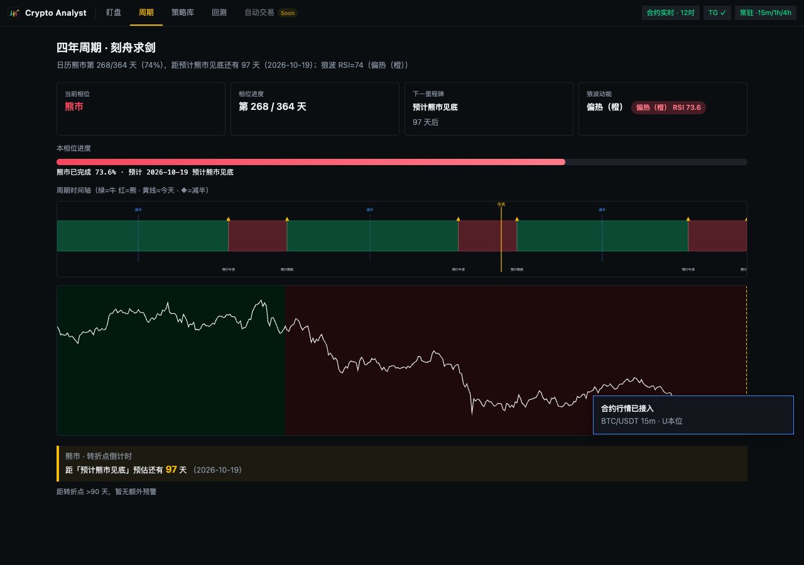

# Crypto Analyst

本地跑的 **AI 行情分析 + U 本位永续盯盘 + 牛熊周期工具**。AI 给出观点/计划并落库复盘；规则引擎常驻盯盘，命中后推 Telegram——**只提醒，不下单**。

<p align="center">
  
</p>
<p align="center"><em>Web 盯盘：顶栏 盯盘 → 周期 → 策略库 → 回测 · K 线与计划线 · AI 侧栏 · 周期倒计时告警</em></p>

<p align="center">
  
</p>
<p align="center"><em>Telegram：双线反转 / 周期切换 / 转折点倒计时等提醒</em></p>

---

## 能力一览

| | AI 分析 | 实时盯盘 | 周期与组合策略 |
|---|---|---|---|
| **做什么** | 拉多周期数据 → LLM 出观点与计划 → 到期对照 K 线验证 | 规则扫形态（双线反转等）→ Web / Telegram 提醒 | Wolfy 四年周期位置 + `cycle_switch` 牛熊切换；经典策略长周期回测 |
| **入口** | Web 右侧「AI 行情分析」，或 `analyst practice` | 打开 Web；开常驻后关页面也推 TG | 顶栏「周期」（盯盘后第二项）；`analyst cycle-outlook` / `backtest-classic` |
| **数据** | 会话写入 `analyst.db` | 观察列表 + 告警；K 线本身不长期落库 | BTC 日线定日历相位；组合回测自动分页拉 2–5 年历史 |

```
盯盘推送（Web / TG）  ←→  选币做 AI 分析落库  →  到期验证  →  历史复盘
                              ↑
              周期图 / cycle_switch 仓位变化 / 转折点倒计时提醒
```

### Web 周期图

<p align="center">
  
</p>
<p align="center"><em>周期专页：相位进度 · 时间轴色带 · 转折点倒计时 · 狼波 RSI</em></p>

顶栏 **「周期」**（紧跟「盯盘」）进入四年周期专页（基于 BTC 日线）：

- **刻舟求剑日历**：牛 1064 天 / 熊 364 天，显示当前相位进度与下一转折点
- **转折点倒计时**：距预计牛顶 / 熊底还有多少天（≤30 天高亮）
- **时间轴色带**：历史牛熊分段 + 减半标记 + 价格背景折线
- **狼波动能**：RSI 分区（过热 / 超卖），与日历交叉确认

数据每 5 分钟自动刷新；与主图 WebSocket 独立，固定用 BTC 日线。

### Web 应用导航

顶栏从左到右：**盯盘** · **周期** · **策略库** · **回测** · **自动交易**（Soon）。策略库可跳转回测或周期页；回测页与 CLI `backtest-classic` 同源。

---

## 5 分钟上手

**1. 安装**（项目根目录）

```bash
uv sync --extra web
# 或：python3 -m venv .venv && source .venv/bin/activate && pip install -e ".[web]"
```

**2. 配置**

```bash
cp .env.example .env
```

编辑 `.env`，至少填一个 LLM（示例默认 DeepSeek）：

```bash
LLM_PROVIDER=deepseek
DEEPSEEK_API_KEY=sk-你的key
```

要推 Telegram 再加，并打开常驻：

```bash
TELEGRAM_BOT_TOKEN=...
TELEGRAM_CHAT_ID=...
MONITOR_ALWAYS_ON=true
```

初始化库并自检：

```bash
analyst db init
analyst config test-llm
```

**3. 启动 Web**

```bash
./scripts/run-web.sh
# 等价：analyst web
```

打开 **http://127.0.0.1:8000**。改代码后重新跑脚本即可（会先释放端口再启动）。

---

## 配置速查

详细注释见 [`.env.example`](.env.example)。常用项：

| 变量 | 作用 |
|------|------|
| `DEEPSEEK_API_KEY` / `LLM_*` | 主分析线路（还可切 b.ai / Anthropic / Groq 等） |
| `DEFAULT_SYMBOLS` | 默认观察列表；常驻品种未单独配置时也用这份 |
| `MONITOR_ALWAYS_ON` | `true`：Web 进程在跑时关页面也继续盯盘并推 TG |
| `MONITOR_DAEMON_TIMEFRAMES` | 常驻多周期，如 `15m,1h,4h` |
| `MONITOR_DAEMON_SYMBOLS` | 常驻品种；空则跟 `DEFAULT_SYMBOLS` / 页面观察列表（常驻模式下加减币**无需重启**） |
| `MONITOR_CYCLE_SWITCH_ENABLED` | `true`：4h 收盘评估 `cycle_switch` 仓位变化并推 TG |
| `MONITOR_CYCLE_OUTLOOK_ENABLED` | `true`：BTC 临近周期转折点（≤90 天）时推 TG |
| `MONITOR_VOLUME_SPIKE_RATIO` | 放量告警阈值（默认 `2.0`） |
| `MONITOR_TOUCH_COOLDOWN_BARS` | 支撑/阻力触及告警冷却根数 |
| `TELEGRAM_BOT_TOKEN` / `CHAT_ID` | 告警推送 |

Web **固定 U 本位永续**，无需再配「现货 / 合约」切换。

---

## 策略库

```bash
analyst strategies    # 列出全部策略及 CLI 示例
```

| 类型 | ID | 说明 |
|------|-----|------|
| **实时** | `double_line` | 双线反转：15m 形态突破 + EMA200 过滤，走 monitor 收盘评估 |
| **组合** | `cycle_switch` | 牛熊周期切换（D）：减半日历×200 日线双确认；牛市唐奇安只多，熊市反弹做空半仓 |
| **组合** | `donchian` | 唐奇安 40/20 通道只多，低频趋势基线 |
| **组合** | `ema_cross` | EMA 双均线 always-in |
| **组合** | `boll_mr` | 布林均值回归（对照组） |

实时策略与组合策略**互补**：前者盯短线形态，后者看长周期仓位与牛熊相位。

---

## CLI（可选）

```bash
analyst practice BTC          # 创建分析会话
analyst verify                # 验证已到期会话
analyst history               # 历史列表
analyst backtest BTC -t 15m   # 双线反转 + 规则告警历史回放
analyst backtest-classic BTC -s cycle_switch --days 1825   # 组合策略长周期回测
analyst cycle-outlook         # Wolfy 周期展望（终端）
analyst cycle-status          # 当前牛熊相位 + 各币 cycle_switch 目标仓位
analyst monitor once BTC -t 15m
```

| 命令 | 作用 |
|------|------|
| `analyst web` | Web + 常驻盯盘 + 周期图 API |
| `analyst practice <symbol>` | AI 分析并落库 |
| `analyst verify` | 验证到期会话 |
| `analyst backtest <symbol>` | 双线反转策略胜率 + 规则命中率回放 |
| `analyst backtest-classic <symbol>` | 经典组合策略回测（复利、手续费、牛熊分段、样本外） |
| `analyst cycle-outlook` | Wolfy 日历 + 狼波 RSI + 转折点倒计时 |
| `analyst cycle-status` | 实时 `cycle_switch` 各品种目标仓位 |
| `analyst strategies` | 策略库目录 |
| `analyst history` / `review <id>` | 历史 / 单条复盘 |
| `analyst progress` / `weakness` / `ai-benchmark` | 统计 |
| `analyst config test-llm` | LLM 连通 |
| `analyst db init` | 初始化 SQLite |

---

## 回测

### 实时策略回放（`analyst backtest`）

用**和实时盯盘同一套评估代码**在历史 K 线上向前回放，量化告警质量：

```bash
analyst backtest BTC -t 15m --bars 1000        # 最近 1000 根 15m
analyst backtest SOL -t 1h --bars 1500 --json r.json   # 结果另存 JSON
analyst backtest ETH -t 4h --no-rules          # 只测策略，跳过规则统计
```

| | 双线反转策略 | 规则告警 |
|---|---|---|
| **怎么测** | 逐根收盘回放，出信号即按计划模拟下单 | 每条带方向的告警做 ATR 屏障前瞻 |
| **输出** | 胜率、累计 R、PF、最大回撤 | 每条规则的样本数 / 命中率 |

### 经典组合策略（`analyst backtest-classic`）

长周期仓位回测，含单边手续费/滑点、复利收益、牛熊震荡分段贡献与样本外验证：

```bash
analyst backtest-classic BTC -s donchian --days 1825      # 唐奇安只多 5 年
analyst backtest-classic BTC -s cycle_switch --days 1825  # 牛熊周期切换
analyst backtest-classic ETH -s ema_cross -t 4h --oos-days 365
```

可选策略：`-s donchian | ema_cross | boll_mr | cycle_switch | buy_hold`

读数参考：规则命中率 ≈50% 说明单独使用无优势；组合策略在加密市场**做空腿普遍拖累收益**，`cycle_switch` 仅在熊市用反弹做空；样本 < 10 或日历边界过拟合需谨慎。

---

## 四年周期（Wolfy 刻舟求剑 + 狼波）

基于 BTC 日线的**周期位置参考**（非交易信号，仅供参考）：

- **图 1 日历**：锚定历次熊市底部，牛市 1064 天 → 预计见顶，熊市 364 天 → 预计见底
- **图 2 狼波**：RSI + 短期动量近似 TradingView 狼波指数，红区过热、蓝区超卖
- **提醒**：距转折点 ≤90 天推 TG；页面与告警均显示**倒计时天数**

```bash
analyst cycle-outlook              # 终端查看当前相位与倒计时
analyst cycle-outlook --telegram   # 同时推 TG
analyst cycle-status               # cycle_switch 各币实时目标仓位
```

Web：`GET /api/monitor/cycle-timeline` · 顶栏「周期」专页（盯盘后第二项）

---

## 本地会生成什么

| 路径 | 内容 |
|------|------|
| `analyst.db` | AI 会话、计划、验证、聊天 |
| `.cache/data/monitor_daemon.json` | 常驻盯盘品种（页面观察列表可同步过来） |
| `.cache/data/` | REST 短缓存（可删） |
| `.env` / `.venv/` | 本地密钥与虚拟环境（已 gitignore） |

实时 WS K 线只在内存滚动，**不**当历史库存。

---

## 开发

```bash
uv sync --extra web --extra dev
pytest tests/ -q
python scripts/generate_favicon.py   # 重新生成 favicon.ico
```

```
crypto-analyst/
├── docs/images/       # README 截图
├── prompts/           # LLM 提示词
├── scripts/run-web.sh
├── scripts/generate_favicon.py
├── src/analyst/
│   ├── backtest/classic.py      # 组合策略回测
│   ├── compute/cycle_theory.py  # Wolfy 日历 + 狼波
│   └── compute/strategies/      # double_line / cycle_switch / registry
└── tests/
```

---

## 说明

- **不自动下单**；盈亏与决策自负。
- 周期日历为「刻舟求剑」模型，里程碑日期有**过拟合历史**风险，请与盘面结合判断。
- 需能访问 Binance 行情；Python **3.11+**。
